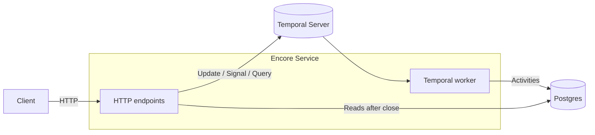
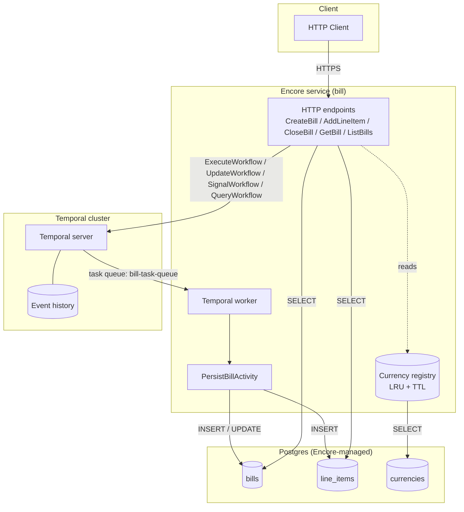
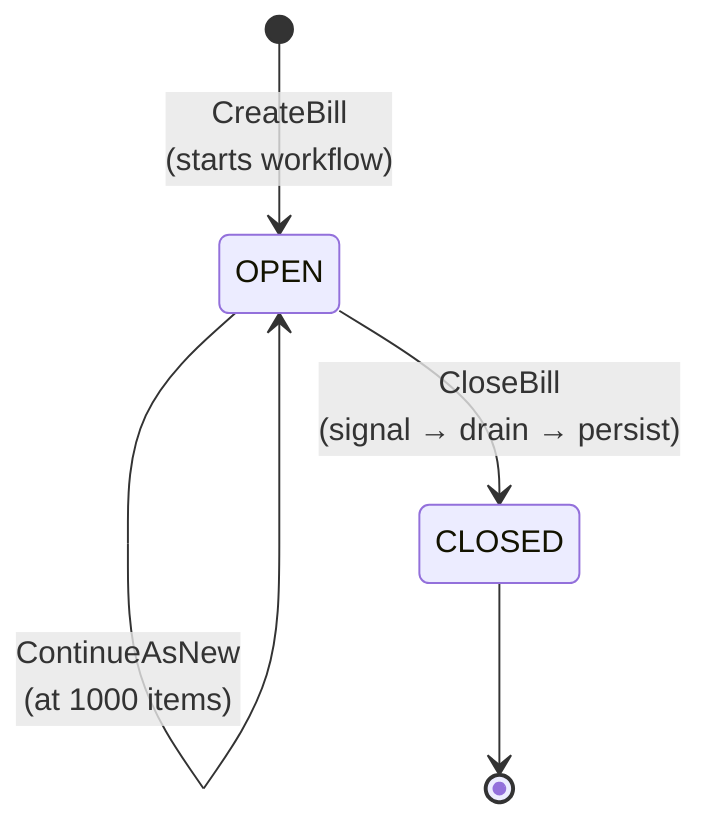

# Pave Bank Fees API

A billing service built on [Encore](https://encore.dev) (HTTP, deploy, DB)
and [Temporal](https://temporal.io) (durable workflow per bill).

A bill is a long-running Temporal workflow that accumulates line items via
synchronous workflow updates and finalises on a close signal. Closed bills
are persisted to Postgres in a single transactional activity. Currencies
are a configurable registry — operators INSERT into the `currencies` table
to enable a new code, no code deploy.

## Quick start

```bash
docker compose up -d            # Temporal server on :7233, UI on :8233
encore run                       # Encore provisions PG and runs migrations
open http://localhost:9400      # Encore dev dashboard
open http://localhost:8233      # Temporal Web UI
```

The Encore app listens on `:4000` by default.

## At a glance



## Architecture



Since we are building with **Encore** and **Temporal** as the focus,
Encore owns the HTTP surface, deployment, db migration/connection (Postgres).
Temporal owns the durability and concurrency aspect: we spawn one workflow per bill,
sequentially updating and signalling within a single goroutine.
Handling of race conditions and crash recovery on the in-flight bill state.
Postgres records only confirmed closed bills and supported currencies that
is configurable via the currency registry. Open bills live only in workflow state.

## Bill Lifecycle (State)



If the bill triggers `CloseBill` the bill will be immutable.

## API

| Method | Path                    | Purpose                                   |
| ------ | ----------------------- | ----------------------------------------- |
| POST   | `/bills`                | Create a bill (starts a workflow)         |
| POST   | `/bills/:id/line-items` | Add a line item (sync workflow update)    |
| POST   | `/bills/:id/close`      | Close a bill (signal + drain + persist)   |
| GET    | `/bills/:id`            | Get a bill (workflow query → DB fallback) |
| GET    | `/bills?limit=&offset=` | List closed bills (DB, paginated)         |

Amounts are JSON strings (full decimal precision). Currencies are
ISO-4217 codes; whether a code is accepted is governed by the
`currencies` table.

### Create a bill

```bash
curl -X POST http://localhost:4000/bills \
  -H 'Content-Type: application/json' \
  -d '{"currency": "USD"}'
# {"billId": "<uuid>", "status": "OPEN", "currency": "USD"}
```

### Add a line item

```bash
curl -X POST http://localhost:4000/bills/<billId>/line-items \
  -H 'Content-Type: application/json' \
  -d '{
    "idempotencyKey": "fee-2026-01",
    "description":    "Monthly service fee",
    "amount":         "15.00",
    "currency":       "USD"
  }'
# {"itemId": "fee-2026-01", "billTotal": "15.00", "itemCount": 1}
```

The update is synchronous: by the time the response returns, the
workflow has applied the item and the totals reflect it. A currency
mismatch, non-positive amount, or empty description is rejected by the
workflow's validator and returns `InvalidArgument` _without_ mutating
state.
**Note**: `idempotencyKey (optional)`

### Close a bill

```bash
curl -X POST http://localhost:4000/bills/<billId>/close
```

Sends a `CloseBill` signal. The workflow drains any in-flight updates,
flips `status` to `CLOSED`, and runs `PersistBillActivity` (idempotent
upsert) inside a transaction.

## Testing

```bash
encore test ./bill/...          # all tests
encore test -cover ./bill/...   # with coverage
```

Tests run under the Encore harness because the package imports
`encore.dev/storage/sqldb`, which panics outside the runtime.

## Design decisions

- **One currency per bill.** The workflow validator rejects items whose
  currency differs from the bill's. Cross-currency conversion is a
  separate concern.
- **Idempotent line items.** Duplicate `idempotencyKey` values are
  silently ignored at the workflow level (no double-counting).
- **`shopspring/decimal` end-to-end.** No `int64` minor units. Amounts
  are stored as `NUMERIC(30,10)` so FX and interest math stays exact.
- **ContinueAsNew at 1000 items.** Keeps Temporal history bounded.
  State is carried over as a `Snapshot` field on `BillWorkflowInput`.
- **No DB writes until close.** All in-flight state lives in the
  workflow. Eliminates dual-write consistency issues.
- **Fail-closed registry.** A DB outage during a cache miss makes the
  service reject unknown currencies rather than admit them.
