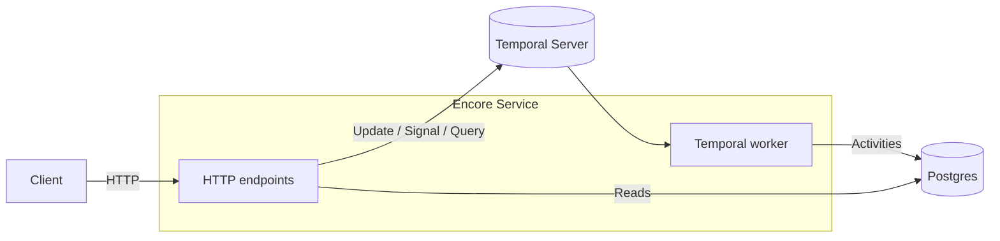
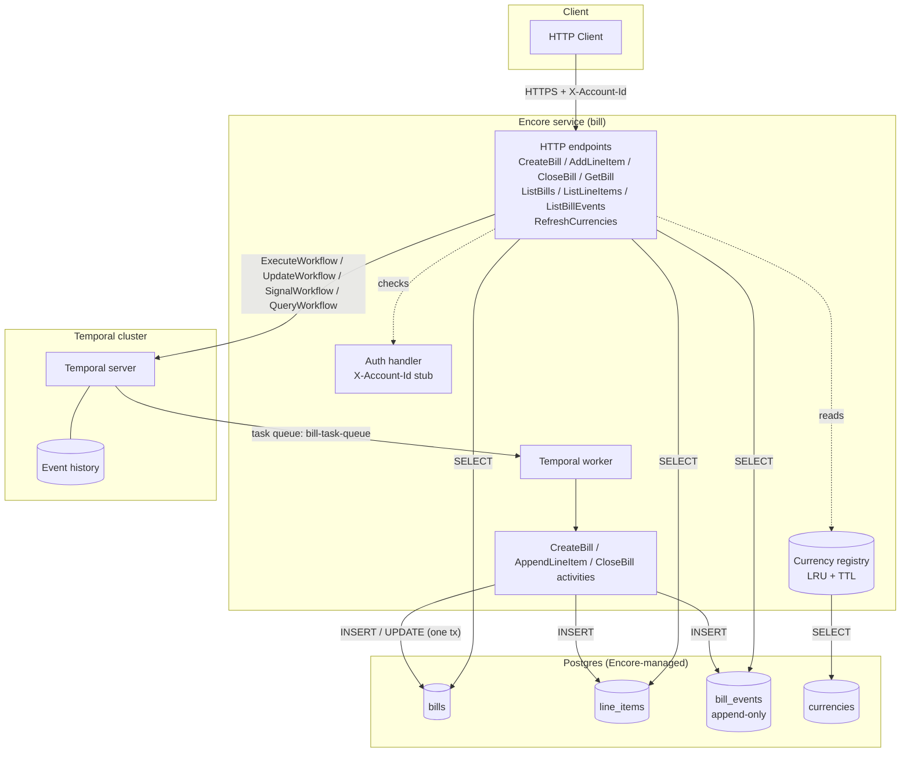
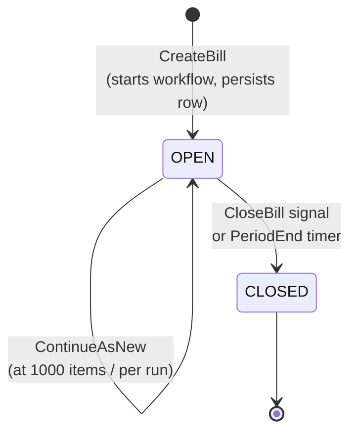

# Pave Bank Fees API

A billing service built on [Encore](https://encore.dev) (HTTP, deploy, DB)
and [Temporal](https://temporal.io) (durable workflow per bill).

A bill is a long-running Temporal workflow that accumulates line items via
synchronous workflow updates, persists each item incrementally through an
activity, and finalises on a close signal or when its period-end timer
fires. The bill row, line items, and an append-only audit log all live in
Postgres from creation; the workflow itself holds only the running
summary so per-run history stays bounded regardless of bill size.

## Quick start

```bash
docker compose up -d            # Temporal server on :7233, UI on :8233
encore run                       # Encore provisions PG and runs migrations
open http://localhost:9400      # Encore dev dashboard
open http://localhost:8233      # Temporal Web UI
```

The Encore app listens on `:4000` by default.

## At a glance



## Architecture



Encore owns the HTTP surface, deploy, and Postgres. Temporal owns
durability and concurrency for the in-flight bill — one workflow per
bill, with updates serialised on a single workflow coroutine.

## Bill lifecycle



Each transition writes an immutable row to `bill_events` (OPENED,
ITEM_ADDED, CLOSED) inside the same DB transaction as the bill mutation.

## API

| Method | Path                              | Purpose                                          |
| ------ | --------------------------------- | ------------------------------------------------ |
| POST   | `/bills`                          | Create a bill (starts a workflow)                |
| POST   | `/bills/:id/line-items`           | Add a line item (sync workflow update)           |
| POST   | `/bills/:id/close`                | Close a bill (signal + drain + persist)          |
| GET    | `/bills/:id`                      | Get a bill (workflow query → DB fallback)        |
| GET    | `/bills`                          | List bills, scoped to caller (keyset cursor)     |
| GET    | `/bills/:id/line-items`           | Paginated line items (keyset cursor)             |
| GET    | `/bills/:id/events`               | Append-only audit log (keyset cursor)            |
| POST   | `/admin/currencies/refresh`       | Force currency registry reload                   |

All endpoints require the `X-Account-Id` header (stub auth, see below).
Amounts are JSON strings (e.g. `"15.99"`, `"0.0001"`) so full decimal
precision is preserved end-to-end — no float, no minor-unit ints.
Currencies are ISO-4217 codes; whether a code is accepted is governed
by the `currencies` table.

### Authentication (stub)

Every request must include an `X-Account-Id: <opaque-id>` header. The
asserted ID is validated against the local `clients` table; unknown
IDs return `401 Unauthenticated` (deliberately indistinguishable from
a missing header so callers can't enumerate valid IDs). The caller's
account scopes both ownership (you can only see/mutate your own
bills) and the audit-log actor field.

**Seed clients (loaded by migration):**

| ID                | Status    | Notes                              |
| ----------------- | --------- | ---------------------------------- |
| `acct-alpha`      | ACTIVE    | Default demo account               |
| `acct-beta`       | ACTIVE    | Second demo account, for tenancy   |
| `acct-suspended`  | SUSPENDED | Reads OK, every write returns 403  |

`SUSPENDED` accounts can still read their own bills (so a frozen
account can inspect its balance during dispute resolution) but every
mutating endpoint returns `403 PermissionDenied`.

**This is a two-layer stub.** In production, replace the header with
real auth (JWT / mTLS / SSO) AND replace the local `clients` table
with a call to an external account / identity service. The bills
service should not own client data — it should treat account IDs as
opaque strings supplied by a trusted identity service. See the
`TODO production` comments in `bill/auth.go` and `bill/clients.go`.

### Create a bill

```bash
curl -X POST http://localhost:4000/bills \
  -H 'Content-Type: application/json' \
  -H 'X-Account-Id: acct-42' \
  -H 'Idempotency-Key: monthly-fee-2026-01' \
  -d '{
    "currency":    "USD",
    "periodStart": "2026-01-01T00:00:00Z",
    "periodEnd":   "2026-02-01T00:00:00Z"
  }'
# {"billId": "<uuid>", "status": "OPEN", "currency": "USD",
#  "periodStart": "...", "periodEnd": "..."}
```

`periodEnd` is optional — when set, the workflow auto-closes when the
timer fires (no explicit CloseBill needed). `Idempotency-Key` is
optional but recommended: with it, a retry deterministically maps to
the same bill (server-derived UUID over account + key) and returns
the existing state on the second call.

### Add a line item

```bash
curl -X POST http://localhost:4000/bills/<billId>/line-items \
  -H 'Content-Type: application/json' \
  -H 'X-Account-Id: acct-42' \
  -d '{
    "idempotencyKey": "fee-2026-01",
    "description":    "Monthly service fee",
    "amount":         "15.00",
    "currency":       "USD"
  }'
# {"itemId": "fee-2026-01", "billTotal": "15.00", "itemCount": 1}
```

Synchronous: by the time the response returns the item is persisted
to Postgres and the totals reflect it. The workflow validator returns
typed errors that the API maps cleanly:

| Rejection                       | HTTP                  |
| ------------------------------- | --------------------- |
| Caller does not own the bill    | 404 NotFound          |
| Currency does not match the bill | 409 FailedPrecondition |
| Amount non-positive / missing description | 400 InvalidArgument |

### Close a bill

```bash
curl -X POST http://localhost:4000/bills/<billId>/close \
  -H 'X-Account-Id: acct-42'
```

Sends a `CloseBill` signal. The workflow drains any in-flight updates,
flips `status` to `CLOSED`, and runs `CloseBillActivity` (transactional
with the audit event). **Idempotent on retry**: if the workflow has
already completed (previous successful close, or period-end timer),
the endpoint returns the persisted state with 200 instead of a 404.

### Paginated reads

`GET /bills?cursor=&limit=&status=` and `GET /bills/:id/line-items?cursor=&limit=`
use keyset pagination over `(created_at, id)`. Pass back the
`nextCursor` from each response; empty `nextCursor` means no more
pages. OFFSET-based pagination is not supported because it scans
linearly as the table grows.

`GET /bills/:id/events` returns the append-only audit trail in
chronological order, with the same cursor shape.

## Testing

```bash
encore test ./bill/...          # all tests
encore test -cover ./bill/...   # with coverage
```

Tests run under the Encore harness because the package imports
`encore.dev/storage/sqldb`, which panics outside the runtime.

## Design decisions

- **Incremental persistence.** Each line item is written to Postgres
  inside its `AppendLineItemActivity` (transactional with the audit
  event and the running-total bump). The original "no DB writes until
  close" design buffered items in workflow memory; it didn't scale
  past a few hundred items per bill without either an unbounded
  workflow history or a giant ContinueAsNew snapshot. Incremental
  writes keep workflow history bounded, make open bills visible to
  BI/ops, and remove the risk of losing N items if a final close
  activity fails. The cost is one DB round-trip per `AddLineItem`.
- **One currency per bill.** The workflow validator rejects items
  whose currency differs from the bill's. Cross-currency conversion
  is a separate concern.
- **Idempotent line items.** Duplicate `idempotencyKey` values are
  no-ops at both the workflow (seen-set) and DB (ON CONFLICT) layers
  — the bill total is never double-counted.
- **Idempotent CreateBill.** Optional `Idempotency-Key` header maps
  deterministically to the bill UUID, so a retried POST returns the
  existing bill rather than creating a duplicate.
- **`shopspring/decimal` end-to-end.** No `int64` minor units. Amounts
  are stored as `NUMERIC(30,10)` so FX and interest math stay exact.
- **ContinueAsNew at 1000 items per run.** The handoff carries only
  `{summary, total, item count, seen-set}` — constant size regardless
  of bill size — since line items live in the DB now.
- **Append-only audit log.** `bill_events` carries OPENED, ITEM_ADDED,
  and CLOSED events with actor + JSON payload. UPDATE/DELETE are
  blocked by triggers; the API surface is read-only. Activities are
  the only producers, and each event is written in the same
  transaction as the underlying mutation.
- **Tenancy via stub auth.** `X-Account-Id` header asserts caller
  identity; per-bill endpoints check ownership (`NotFound` on
  mismatch so existence isn't leaked across tenants). Production
  replacement is documented inline.
- **Fail-closed registry.** A DB outage during a currency cache miss
  rejects unknown codes rather than admitting them. A manual refresh
  endpoint lets operators pick up newly added currencies without
  waiting for the TTL.
- **Custom business metrics.** Counters for bills opened (by
  currency), closed (by reason: SIGNAL vs PERIOD_END), line items
  added (accepted / duplicate / rejected), and validator rejections
  (by reason). Endpoint latency is auto-tracked by Encore.
